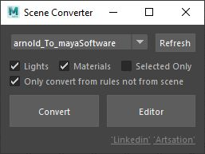
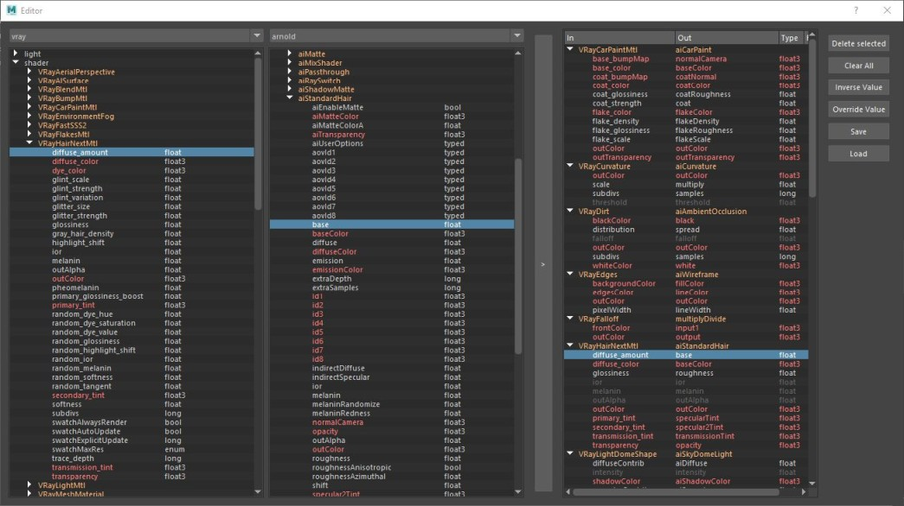

# Maya Scene Converter

#### Work in progress

Maya Scene Converter is a python-based Qt tool for converting scenes
from a render engine to another in Maya, it is not a perfect conversion and it depends on rules files
and how good they are but gives you a great head start.

## Features 

* Creates rules to convert from a source render engine to a target render engine
* Easy UI to create, save and load the rules
* Supports all shading related nodes: Materials,Textures,Utilities and Lights
* Converts all the scene or selected objects
* Scans the scene for any node or only what belongs to the source engine
* Some ready examples of rules files (not very precise but very functional)
* Prints info about all conversions
* Tested with Windows only but could work on other operating systems
* Tested with Maya 2018+ but could work on previous versions

## Tutorials

* [How to convert](https://www.youtube.com/watch?v=I4shNs4srKw)
* [How to create new rules](https://www.youtube.com/) soon

## Installation

1. Download and unzip the *MayaSceneConverter.zip* file from [github releases](https://github.com/mhdmhd/MayaSceneConverter).

2. Drag and drop the "SceneConverter/install.mel" file onto the Maya viewport.

3. Click the icon on the shelf to run.

## Contributing

Contributions are always welcome! Whether it's reporting bugs, feature requests, creating conversion rules,
 discussing ideas or committing code which are actually encouraged.

## License

Maya scene converter is free to use in production under the GNU Lesser General Public License v3.0.
For more information please click [here](LICENSE.md).

## Support

Comments, suggestions and bug reports are welcome.

Feel free to submit any issues with the error message and a detailed step by step process of how you got the error in [github issues](https://github.com/mhdmhd/MayaSceneConverter/issues).

### Scene converter UI

### Scene Converter Editor UI

